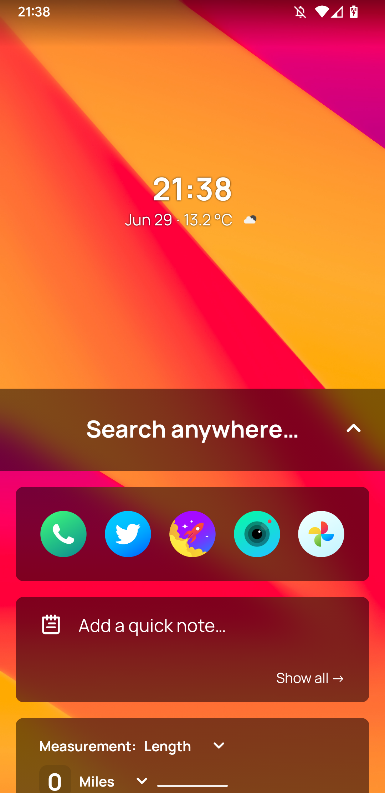
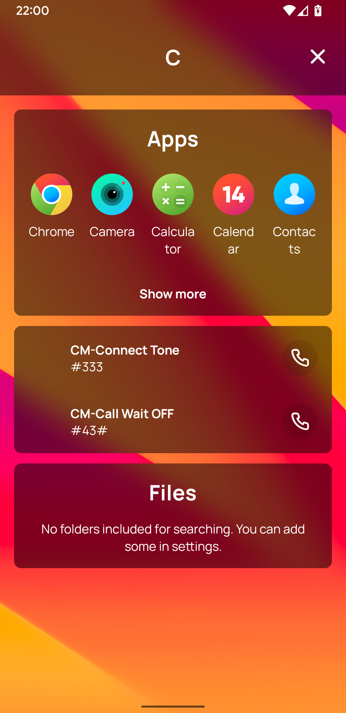
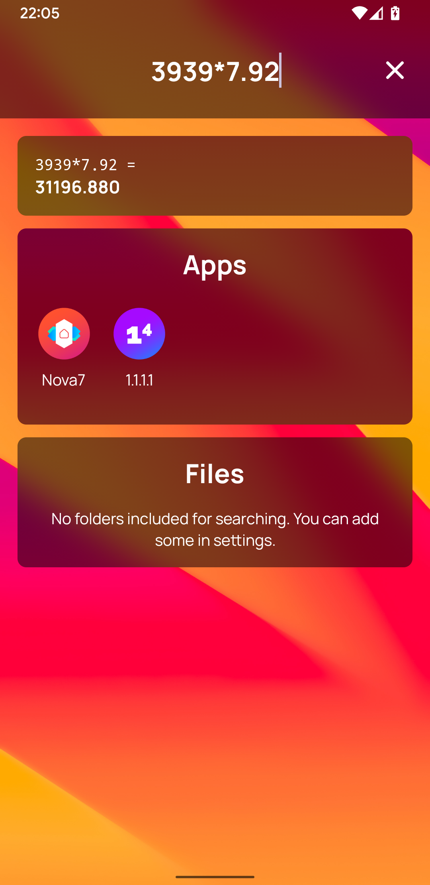
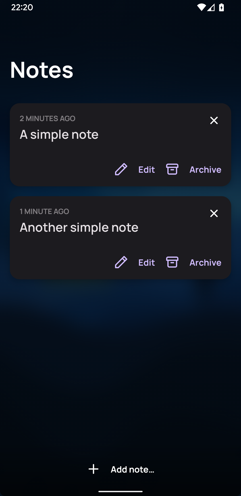

  

<h1 align="center" style="margin-top: 0px;">Starlight Launcher</h1>

  

A beautiful, extensible search-based Android launcher that helps you get things done faster.
Everything you need is right at your fingertips. No more searching through grids of icons.
This is still a work in progress.

## Screenshots

## License

This work is licensed under a
[Creative Commons Attribution-NonCommercial-ShareAlike 4.0 International License][cc-by-nc-sa].

[![CC BY-NC-SA 4.0][cc-by-nc-sa-image]][cc-by-nc-sa]

[cc-by-nc-sa]: http://creativecommons.org/licenses/by-nc-sa/4.0/
[cc-by-nc-sa-image]: https://licensebuttons.net/l/by-nc-sa/4.0/88x31.png
[cc-by-nc-sa-shield]: https://img.shields.io/badge/License-CC%20BY--NC--SA%204.0-lightgrey.svg
